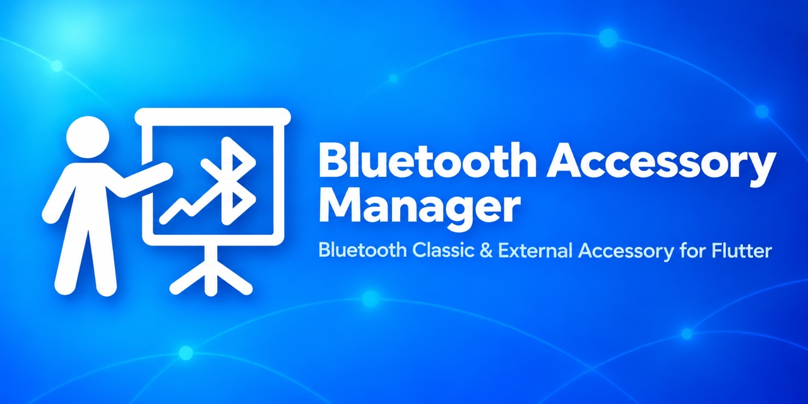

# Bluetooth Accessory Manager

<div align="center">
  
</div>

[](https://pub.dev/packages/bluetooth_accessory_manager)
[](https://github.com/Navideck/bluetooth_accessory_manager)
[](https://github.com/Navideck/bluetooth_accessory_manager)
[](https://pub.dev/packages/bluetooth_accessory_manager/score)
[](https://flutter.dev)
[](https://dart.dev)

A cross-platform Flutter plugin for discovering, pairing, and managing Bluetooth Classic accessories, Bluetooth HID devices, and Apple External Accessory sessions.

> Looking for Bluetooth Low Energy and GATT? See [universal_ble](https://pub.dev/packages/universal_ble).

## Features

- [**Device discovery**](#scanning) — scan for nearby Bluetooth devices and retrieve paired devices.
- [**Pairing**](#pairing) — pair and unpair accessories by address.
- [**Native accessory picker**](#native-accessory-picker) — open the platform picker, with optional device-name filtering.
- [**Bluetooth HID**](#connecting) — connect to HID devices and exchange reports.
- [**SDP registration**](#sdp-service-registration) — advertise a Bluetooth HID service.
- [**Apple External Accessory**](#ios-external-accessory) — receive connection events and manage EA sessions on iOS.
- [**Five desktop and mobile platforms**](#api-support) — Android, iOS, macOS, Windows, and Linux.

## API Support

| API | Android | iOS | macOS | Windows | Linux |
| :-- | :--: | :--: | :--: | :--: | :--: |
| `showBluetoothAccessoryPicker` | ✔️ | ✔️ | ✔️ | ✔️ | — |
| `startScan` / `stopScan` | ✔️ | — | ✔️ | ✔️ | ✔️ |
| `pair` / `unpair` | ✔️ | — | ✔️ | ✔️ | ✔️ |
| `getPairedDevices` | ✔️ | — | ✔️ | ✔️ | ✔️ |
| `connect` (HID) | ✔️ | — | ✔️ | ✔️ | — |
| `disconnect` | ✔️ | — | ✔️ | ✔️ | ✔️¹ |
| `sendReport` | ✔️ | — | ✔️ | ✔️ | — |
| `setupSdp` / `closeSdp` | ✔️ | — | ✔️ | ✔️ | — |
| `onConnectionStateChanged` | ✔️ | — | ✔️ | ✔️ | — |
| `onGetReport` | ✔️ | — | ✔️ | ✔️ | — |
| `onSdpServiceRegistrationUpdate` | ✔️ | — | ✔️ | ✔️ | — |
| `closeEASession` | — | ✔️ | — | — | — |
| `accessoryConnected` / `accessoryDisconnected` | — | ✔️ | — | — | — |

¹ Linux supports a basic disconnect, not an HID-specific disconnect.

## Getting Started

Add the package to your `pubspec.yaml`:

```yaml
dependencies:
  bluetooth_accessory_manager: ^0.1.0
```

Import it where you need it:

```dart
import 'package:bluetooth_accessory_manager/bluetooth_accessory_manager.dart';
```

Complete the setup for each target in [Platform-specific setup](#platform-specific-setup) before using the APIs below.

## Scanning

Register discovery callbacks before starting a scan:

```dart
BluetoothAccessoryManager.onBluetoothDeviceDiscover = (device) {
  print('${device.name ?? 'Unknown'} (${device.address}), RSSI ${device.rssi}');
};

BluetoothAccessoryManager.onBluetoothDeviceRemoved = (device) {
  print('Removed: ${device.address}');
};

await BluetoothAccessoryManager.startScan();
```

Check or stop the scan when needed:

```dart
final isScanning = await BluetoothAccessoryManager.isScanning();

if (isScanning) {
  await BluetoothAccessoryManager.stopScan();
}
```

Scanning is available on Android, macOS, Windows, and Linux.

### Paired devices

```dart
final devices = await BluetoothAccessoryManager.getPairedDevices();

for (final device in devices) {
  print('${device.name ?? 'Unknown'} — ${device.address}');
}
```

### Native accessory picker

Open the platform's Bluetooth accessory picker. On iOS, this uses the External Accessory picker.

```dart
await BluetoothAccessoryManager.showBluetoothAccessoryPicker();
```

Optionally filter by device name:

```dart
await BluetoothAccessoryManager.showBluetoothAccessoryPicker(
  withNames: ['MyDevice', 'AnotherDevice'],
);
```

The native picker is not available on Linux.

## Pairing

Pair or unpair a device by its Bluetooth address:

```dart
final paired = await BluetoothAccessoryManager.pair(
  '00:11:22:33:44:55',
);

if (paired) {
  print('Device paired');
}

await BluetoothAccessoryManager.unpair('00:11:22:33:44:55');
```

Pairing APIs are available on Android, macOS, Windows, and Linux.

## Connecting

Connect to and disconnect from a Bluetooth HID device:

```dart
const deviceId = '00:11:22:33:44:55';

BluetoothAccessoryManager.onConnectionStateChanged =
    (deviceId, connected) {
  print('$deviceId: ${connected ? 'connected' : 'disconnected'}');
};

await BluetoothAccessoryManager.connect(deviceId);
await BluetoothAccessoryManager.disconnect(deviceId);
```

HID connections are available on Android, macOS, and Windows. iOS uses the External Accessory framework instead. Linux supports only the basic `disconnect` operation.

## HID Reports

Send a report to a connected HID device:

```dart
import 'dart:typed_data';

await BluetoothAccessoryManager.sendReport(
  '00:11:22:33:44:55',
  Uint8List.fromList([0x01, 0x02, 0x03]),
);
```

Respond to HID get-report requests:

```dart
BluetoothAccessoryManager.onGetReport =
    (deviceId, reportType, bufferSize) {
  return ReportReply(
    data: Uint8List.fromList([0x01, 0x02, 0x03]),
  );
};
```

HID reports are available on Android, macOS, and Windows.

## SDP Service Registration

Register a Bluetooth HID service with platform-specific configuration:

```dart
import 'dart:typed_data';

final config = SdpConfig(
  macSdpConfig: MacSdpConfig(
    data: {
      'ServiceName': 'My HID Service',
      // Add the remaining SDP properties.
    },
  ),
  androidSdpConfig: AndroidSdpConfig(
    name: 'My HID Service',
    description: 'HID Service Description',
    provider: 'My Company',
    subclass: 0x2540,
    descriptors: Uint8List.fromList([
      // Add the HID report descriptor.
    ]),
  ),
);

BluetoothAccessoryManager.onSdpServiceRegistrationUpdate = (registered) {
  print('SDP service registered: $registered');
};

await BluetoothAccessoryManager.setupSdp(config: config);
```

Close the registration when it is no longer needed:

```dart
await BluetoothAccessoryManager.closeSdp();
```

SDP registration is available on Android, macOS, and Windows.

## iOS External Accessory

The External Accessory callbacks and session APIs in this section are iOS-only.

```dart
BluetoothAccessoryManager.accessoryConnected = (accessory) {
  print('Connected: ${accessory.name}');
  print('Manufacturer: ${accessory.manufacturer}');
  print('Protocols: ${accessory.protocolStrings}');
};

BluetoothAccessoryManager.accessoryDisconnected = (accessory) {
  print('Disconnected: ${accessory.name}');
};
```

Close a session for a specific protocol:

```dart
await BluetoothAccessoryManager.closeEASession(
  'com.mycompany.myprotocol',
);
```

Omit the protocol string to close the session using the first available protocol:

```dart
await BluetoothAccessoryManager.closeEASession();
```

Calling these APIs on another platform throws `UnimplementedError`.

## Data Types

### `BluetoothDevice`

Discovered and paired devices expose:

- `address`
- `name`
- `paired`
- `isConnectedWithHid`
- `rssi`
- `deviceType` — `classic`, `le`, `dual`, or `unknown`
- `deviceClass` — for example `peripheral`, `audioVideo`, or `computer`

### `EAAccessory`

iOS External Accessory callbacks provide the accessory name, manufacturer, model and serial numbers, firmware and hardware revisions, dock type, supported protocol strings, connection status, and connection ID.

### HID configuration

- `SdpConfig` holds the platform-specific `MacSdpConfig` and `AndroidSdpConfig` values used for service registration.
- `ReportReply` returns optional report `data` or an optional HID `error` code from `onGetReport`.
- `ReportType` identifies `input`, `output`, and `feature` reports.

## Platform-specific setup

### Android

Add the Bluetooth permissions to `android/app/src/main/AndroidManifest.xml`:

```xml
<uses-permission android:name="android.permission.BLUETOOTH_SCAN" android:usesPermissionFlags="neverForLocation" />
<uses-permission android:name="android.permission.BLUETOOTH_CONNECT" />
<uses-permission android:name="android.permission.BLUETOOTH" android:maxSdkVersion="30" />
<uses-permission android:name="android.permission.BLUETOOTH_ADMIN" android:maxSdkVersion="30" />
<uses-permission android:name="android.permission.ACCESS_FINE_LOCATION" android:maxSdkVersion="30" />
<uses-permission android:name="android.permission.ACCESS_COARSE_LOCATION" android:maxSdkVersion="28" />
```

Set the minimum Android SDK to 23:

```gradle
android {
    defaultConfig {
        minSdkVersion 23
    }
}
```

Request permissions at runtime. For Android 12 and newer, request Bluetooth scan and connect permissions. For Android 11 and older, request location permission. Packages such as [permission_handler](https://pub.dev/packages/permission_handler) can handle these requests.

### iOS

Declare every External Accessory protocol supported by your accessory in `ios/Runner/Info.plist`:

```xml
<key>UISupportedExternalAccessoryProtocols</key>
<array>
    <string>com.yourcompany.yourapp.protocol</string>
</array>
```

### macOS

Add the Bluetooth capability to your macOS target in Xcode.

### Windows

The Bluetooth adapter must support Bluetooth 4.0 or newer. If the system has multiple adapters, the plugin uses the first adapter returned by Windows.

When packaging the app, declare the [`bluetooth` and `radios` capabilities](https://learn.microsoft.com/en-us/windows/uwp/packaging/app-capability-declarations).

### Linux

The Bluetooth adapter must support Bluetooth 4.0 or newer. If the system has multiple adapters, the plugin uses the first adapter returned by BlueZ.

When distributing the app as a snap, add the `bluez` plug to `snapcraft.yaml`:

```yaml
plugs:
  - bluez
```

Linux supports scanning, paired-device lookup, pairing, unpairing, basic disconnects, and discovery callbacks. The native picker, HID connections and reports, and SDP registration are not implemented.

## Customizing Platform Implementation

Provide a custom implementation for testing or an unsupported platform by extending `BluetoothAccessoryManagerInterface`:

```dart
class BluetoothAccessoryManagerMock
    extends BluetoothAccessoryManagerInterface {
  // Override the APIs used by your application.
}

BluetoothAccessoryManager.setInstance(
  BluetoothAccessoryManagerMock(),
);
```

Restore the default platform implementation with:

```dart
BluetoothAccessoryManager.setInstance(null);
```

## Example app

The [`example`](example) project demonstrates discovery, pairing, HID connections, reports, SDP registration, and platform permission handling.

Run it on a connected device or desktop target:

```sh
cd example
flutter run
```

## App showcase

| | |
| :--: | :-- |
|  | [**BT Cam**](https://btcam.app)<br>A Bluetooth remote for Canon, Nikon, Sony, Fujifilm, GoPro, Olympus, Panasonic, Pentax, and Blackmagic cameras. |

> Built something with Bluetooth Accessory Manager? Open a pull request to add it here, including an SVG app icon.
